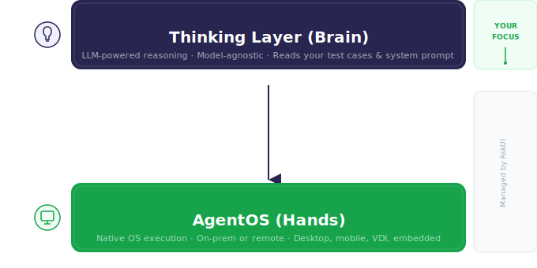
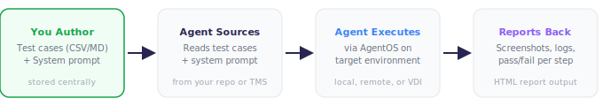
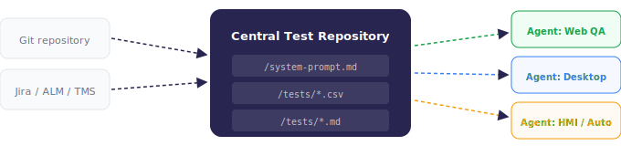
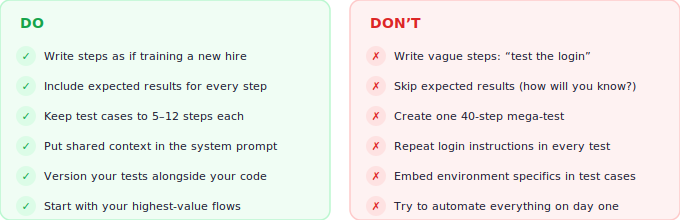

 **AskUI**

A PRACTICAL GUIDE FOR QA TEAMS ADOPTING ASKUI

# QA Testing with AskUI Agents

How to use QA Agents and manage test bases for them that can be executed reliably across environments.

Version 1.0 · March 2026 | AskUI GmbH · Confidential | askui.com

---

# 1. Intro to Agentic QA

## Why To Use Agentic QA?

An AI agent is an AI system that can execute a task by observing, planning and executing actions. In the context of QA, we define QA agents as special agents that can operate real devices in a real environment and are specifically designed to execute actions following test definitions like a human tester.
Using QA agents for testing leads to a fundamental paradigm shift. Testers can focus on describing **what** to test in plain language, e.g. "Click on the Login Button", the agent will then figure out **how**, e.g. "Move the Mouse there and click".
Hence, testers no longer need to write selector-based step-by-step code that breaks as soon as the UI moves a pixel. Instead, they are authoring **intent**, i.e., clear instructions that an intelligent agent interprets and executes, adapting to whatever it encounters on screen.

> **The Paradigm Shift**
>
> Traditional QA: Testers script every click, every selector, every wait condition.
>
> Agentic QA: Testers describe the intent of the test in plain language. A QA agent dynamically translates it into specific actions.

## How to Use Agentic QA?

Agentic QA only works in production when the architecture is right. Most demo-stage agents look impressive but fail under real enterprise constraints, due to different environments, VDIs, legacy apps, or security perimeters. AskUI solves this issue with a purpose-built two-layer stack:



The Thinking Layer (Brain) is the LLM-powered reasoning engine. It reads your test cases and system prompt, understands the intent behind each step, and plans which actions to take next. AskUI is model-agnostic, so the underlying LLM can be swapped without changing your tests.
AgentOS (Hands) is the execution environment where the agent operates. It provides native OS-level control on any target, a local desktop, a remote VM, a VDI session, or even an embedded device, so your tests run identically regardless of where the application lives.

Your job as a QA team is **writing clear test cases and system prompts**. The agent's interactions with the application are handled automatically by AskUI's infrastructure.



The test cases and system prompts are written in plain text (CSV or Markdown) and stored in a central repository. During testing, the agent reads those instructions, executes them on the target environment via AgentOS, and compiles a detailed report.
Test cases and system prompts should live in **one place** that is versioned and accessible. The agent sources them at runtime, it does not have tests baked in.

> **Working with AskUI QA Agents**
>
> You define test cases and prompts in plain text. You never need to touch library code.



Multiple agents can source from the same repository. One agent tests the web app, another tests a desktop client, another tests an automotive HMI, all reading the same system prompt and their respective test suites.

---

# 2. Writing Test Cases, Prompts, Setup & Teardown

The importance of system prompts and test cases can barely be overstated, as the quality of your test results depends almost entirely on the quality of your instructions.
This section covers the three main things you will author: **system prompts** (agent behaviour), **test cases** (what to test), and **setup & teardown instructions**.

> **What Goes in a System Prompt vs. a Test Case**
>
> **System prompt:** General rules, how to handle edge cases, naming conventions.
>
> **Test case:** The specific scenario, what flow to execute and what to verify.
>
> **Setup:** Instructions on environment setup that need to be executed before the tests.
>
> **Teardown:** Cleanup instructions to execute after the tests, to have a clean environment for the next set of tests.

## System Prompts: Setting the Agent's Behaviour

The system prompt tells the agent **how to behave and what to do** across all tests. Think of it as an onboarding document for a new QA hire. It sets the context once, so individual test cases can stay short and focused.
Is compiled from one or more Markdown files that specify 1) the general behaviour of the agent, 2) information on the device it will be operating, 3) information on the UI of the application that is tested, 4) instructions for the report that is generated and 5) any additional rules.
Below is an example for a minimal system prompt of an e-commerce QA Agent.
The example below may look reasonable at first glance, but it has several issues that will hurt the agent's reliability in practice. Let's break down what's wrong and how to fix it.

```markdown
# System Prompt — E-Commerce QA Agent

You are a QA agent testing the ACME webshop at https://shop.acme.com.
You are logged in as a test user (user@test.acme.com / TestPass123).

## Rules
- Always wait for pages to fully load before interacting.
- If a modal or cookie banner appears, dismiss it first.
- After every critical action, verify the result visually.
- If something unexpected happens, take a screenshot and
  report the issue — do NOT try to work around it.

## Environment
- Browser: Chrome (latest)
- Screen resolution: 1920x1080
- Language: English (US)
- Test data prefix: always use "TEST-" in any created records
```

What's wrong with this prompt?

- **Vague rules.** "Always wait for pages to fully load". How should the agent determine that a page has fully loaded? A human tester would know what to look for; the agent does not.
- **No UI descriptions.** The agent has never seen your application before. It doesn't know where the login form is, what the navigation looks like, or how the cookie banner behaves.
- **Missing action details.** "If a modal or cookie banner appears, dismiss it". How? Click an "X"? Click "Accept"? Click outside the modal? The agent needs specifics.

Here is an improved version:

```markdown
# System Prompt — E-Commerce QA Agent

You are a QA agent testing the ACME webshop at https://shop.acme.com.

## Login
- Navigate to https://shop.acme.com/login.
- Enter the username into the "Email" text field and the password into the "Password" text field.
- Click the "Sign In" button.
- You are logged in when you see the text "Welcome back" in the top navigation bar.

## Handling Popups
- On first load, a cookie consent banner appears at the bottom of the page. Click the button labeled "Accept All" to dismiss it.
- If a promotional modal appears (it has a large image and a "Shop Now" button), click the "X" icon in the top-right corner of the modal to close it.

## Navigation
- The main navigation bar is at the top of the page and contains: "Home", "Products", "Categories", "Cart", and "Account".
- The search bar is located in the top-right area. Click the magnifying glass icon to expand it, then type your query.

## Environment
- Browser: Chrome (latest)
- Screen resolution: 1920 × 1080
- Language: English (US)
- Test data prefix: always use "TEST-" in any created records

## General Rules
- After every action, verify the result before proceeding to the next step.
- If something unexpected happens, take a screenshot and report the issue — do NOT try to work around it.
```

## Test Cases: Describing What to Test

Test cases should be stored as CSV files or Markdown documents in a central location (git repo, shared drive, or test management system), where the agent can read them at runtime.
Generally, we support two different formats for test cases, CSV files and Markdown documents.

### CSV Files

CSV files are best to describe structured, step-by-step tests. Each action and its expected outcome should be explicitly described. They can be authored easily in any spreadsheet tool, e.g. MS Excel.
We recommend using a format with the five columns in the example below.

The table below shows a test case that might work, but falls short of best-practice standards. The actions are too brief and the expected results leave room for interpretation.

| Test Case ID | Test Case Name | Step | Action | Expected Result |
|---|---|---|---|---|
| TC001 | Add to Cart | 1 | Search for "Wireless Headphones" | Search results show headphone products |
| | | 2 | Click the first product in the results | Product detail page opens |
| | | 3 | Select size "Medium" from the dropdown | Size is selected |
| | | 4 | Click "Add to Cart" | Cart badge shows "1" item |
| | | 5 | Open the cart | Cart contains "Wireless Headphones" with correct price |

What's wrong?
Step 1 doesn't say where to search.
Step 2 is ambiguous, first product from the top or from the left? By position or by name?
Step 3 assumes a size dropdown exists for headphones. Expected results like "Search results show headphone products" and "Size is selected" are too vague for the agent to verify.
Step 4 and Step five give instructions but do not specify them, e.g. where is the 'Add to Cart' button? How can it be identified?

Here is an improved version

| Test Case ID | Test Case Name | Step | Action | Expected Result |
|---|---|---|---|---|
| TC001 | Add to Cart | 1 | Click the magnifying glass icon in the top navigation bar to open the search bar. Type "Wireless Headphones" and press Enter. | A results page appears showing a list of products. At least one product contains "Wireless Headphones" in its title. |
| | | 2 | Click the product titled "ACME Wireless Headphones Pro" in the search results. | The product detail page opens. The page heading reads "ACME Wireless Headphones Pro" and a price is displayed. |
| | | 3 | In the "Color" dropdown below the product image, select "Black". | The dropdown shows "Black" as the selected option. The product image updates to show the black variant. |
| | | 4 | Click the green "Add to Cart" button. | A confirmation toast appears with the text "Added to cart". The cart icon in the top navigation bar shows a badge with the number "1". |
| | | 5 | Open the cart by clicking on the cart icon in the top navigation bar. | The cart page opens and lists "ACME Wireless Headphones Pro — Black" with a quantity of 1 and a price of $79.99. |

### Markdown Documents

Markdown documents are best for more complex scenarios where you can only describe the *goal* rather than individual steps, as they might change dynamically between executions.

```markdown
# TC002 — Checkout with Discount Code

## Test Goal and Details
- Navigate to the cart, proceed to checkout and complete the purchase.
- Enter the discount code "SAVE20" where applicable, and verify that it is applied.
- If necessary, please use the following test payment details:
   - Card: 4111 1111 1111 1111
   - Expiry: 12/28
   - CVC: 123
- Verify the order confirmation page shows:
   - An order number starting with "ORD-"
   - The discounted total
   - Estimated delivery date
```

> **CSV vs. Markdown — When to Use Which**
>
> **CSV:** Highly structured, repeatable flows. Best for regression suites where every step should be traced. Easiest for non-technical team members to author.
>
> **Markdown:** Complex or exploratory scenarios. Gives the agent more room to reason. Better for tests that involve decision-making (e.g., "if this fails, try that").

## Setup and Teardown Instructions: Prepare for and Cleanup after Test

Test cases often have a set of specific prerequisites that need to be met before the actual test can start. This can include to login into a system or opening a specific application.
AskUI supports dedicated setup and teardown files to handle these prerequisites automatically.
Place a setup.md file in the same directory as your test case files, and the agent will execute its instructions before running any test in that directory.
Similarly, a teardown.md file will be executed after all tests in that directory have completed.
This keeps repetitive preparation and cleanup steps, such as logging in, navigating to a starting page, or resetting test data, out of your individual test cases, making them shorter and easier to maintain.

---

# 3. Best Practices

The difference between teams that succeed with agentic QA and those that struggle usually comes down to how they write the instructions in their system prompts and test definitions.
The following practices are based on real enterprise rollouts.



## Best Practice #1: Write Steps Like You Are Training a New Hire

The agent is intelligent, but it can only reason on the information you provide. If you were sitting next to a new team member showing them the test, what would you say? That is exactly what to write.

**Weak Instructions:**
- "Test the login"
- "Check the form works"
- "Make sure the page loads"
- "Verify the data"

**Strong Instructions:**
- "Enter admin@acme.com in the Email field and click Sign In"
- "Fill in Name, Email, and Phone, then click Submit. Verify the success message appears."
- "Navigate to Settings. The page should show the user profile section within 3 seconds."
- "Verify the order total shows exactly $149.99"

## Best Practice #2: Be Detailed and Remove Ambiguity

Ambiguity is the number one cause of flaky agent tests. Whenever the agent has to guess what you mean, it might guess differently next time.
Remove every opportunity for misinterpretation by being specific about what to interact with, how to interact with it, and what the result should look like.

## Best Practice #3: Iterate Forward

Do not expect your tests to pass perfectly on the first run. Setting up agentic QA is an iterative process!
Just like onboarding a new team member, the first attempts will reveal gaps in your instructions that you didn't anticipate. This is normal and expected.

When a test fails, in most cases, the reason was not rooted in the agent but in your test cases or system prompt. Work through the following improvement steps in order:

1. **Make the failing step more explicit.** Often the agent misinterpreted a vague instruction. Hence, you need to rewrite it with more detail. Specify exactly which element to interact with and what the expected outcome looks like.
2. **Remove ambiguity.** If the agent clicked the wrong button or entered text in the wrong field, your instruction likely left room for interpretation. Describe the correct element, its position, and its label.
3. **Add missing steps.** Sometimes the agent fails because a prerequisite step was assumed but never stated. If the agent needs to scroll down, close a popup, or wait for a loading spinner to disappear before proceeding, add that as an explicit step.
4. **Improve the system prompt.** If you notice the same issue across multiple tests, for example, the agent consistently struggles with a particular UI pattern, add a general instruction to the system prompt rather than fixing each test individually.
5. **Add a targeted rule for edge cases.** If a specific interaction keeps failing despite clear instructions, add a precise rule to the system prompt that addresses that exact issue. For example: "When adding an item to the cart, ALWAYS use the 'Add to Cart' button below the product description. NEVER use the 'Add to Cart and Show Cart' button in the right sidebar."

## Best Practice #4: Separate Behaviour (Prompt) from Scenario (Test Case)

Stuffing environment details, login steps, and general rules into every single test case leads to duplications and makes maintaining your suite increasingly difficult.

**System Prompt** — Set once, applies to all tests.
- Target URL / application
- Credentials
- How to handle popups
- Naming conventions
- Environment info

**Test Case** — One focused scenario per file.
- Preconditions
- Steps to execute
- Expected results
- Test data

## Best Practice #5: Always Include Expected Results

A human tester knows the application they are testing and hence has an understanding of *what should happen* after every step. It is important to make this information available to the QA Agent as well.
Without this, the agent has no way to know if the test passed or failed. This is the single most impactful improvement you can make to your test suite.

| Action | Expected Result |
|---|---|
| Click "Add to Cart" | Cart icon shows "1" and a confirmation toast appears |
| Enter discount code "SAVE20" and click Apply | Total decreases by 20%. Line item shows "Discount: -$29.99" |
| Submit the contact form | Page shows "Thank you! We'll be in touch within 24 hours." |

## Best Practice #6: Keep Tests Short and Focused

One test, one scenario, 5–12 steps. When a test fails at step 37 of a 50-step marathon, nobody knows what went wrong. Small tests fail clearly and are faster to debug.

> **The 12-Step Rule**
>
> If your test case has more than 12 steps, split it. Each test should cover one logical user journey: login, search, checkout, profile update; not all four chained together. If tests share setup (e.g., "must be logged in"), put the login instructions into the system prompt's preconditions, not in every test.

## Best Practice #7: Avoid the "Demo Trap"

A test that works on your local machine in a demo does not mean it will work in production. The "demo trap" is when teams build agentic QA for controlled conditions and are surprised when it fails in the real world.

To avoid this:

- **Test on realistic environments early.** Do not wait until production to discover that VDI latency breaks your timing assumptions.
- **Account for variability in your expected results.** Write "The total should be approximately $150" instead of "The total is $149.99" when amounts may differ slightly between environments.
- **Use the system prompt to describe the environment.** If the agent will encounter a VPN dialog or a slow-loading page, tell it upfront and provide instructions how to overcome them.

---

# Getting Started Checklist

| # | Task | Details |
|---|---|---|
| 1 | Write a system prompt | Cover your target application, credentials, environment, and general rules. One Markdown file. |
| 2 | Pick your top 3 critical flows | Login, core happy path, and one common edge case. Do not try to cover everything on day one. |
| 3 | Author test cases | 5–10 steps per test. CSV for structured flows, Markdown for complex scenarios. Include expected results. |
| 4 | Store centrally | Git repo or test management system. Version alongside your code so tests and application stay in sync. |
| 5 | Run and review reports | Execute via AskUI. Review the HTML reports, every step includes a screenshot. Adjust wording where the agent misidentified something. |
| 6 | Refine Prompts and Test Cases | Review the HTML report from your first run. For each failed or flaky step, identify whether the issue was a vague instruction, a missing step, or an ambiguity. Refine your test cases and system prompt accordingly. |
| 7 | Expand to more tests | Within a quarter you will have a robust, low-maintenance suite covering your critical paths. |

> **Need Help?**
>
> Your AskUI customer success contact is available to review your first system prompt and test cases. We will pair with your team during onboarding to get your first tests running and refine the instructions. Reach out at **support@askui.com**
